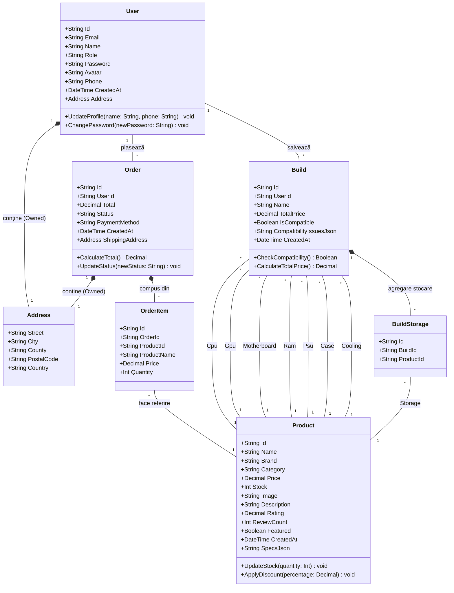

# Documentație Proiect - PcGarage

Acest document acoperă etapele de modelare și proiectare ale aplicației, realizat conform cerințelor specificate.

## 1. Diagrama UML a claselor

Următoarea diagramă ilustrează clasele principale ale aplicației (extrase din modelul bazei de date - `Backend/Models`), atributele lor, precum și relațiile de asociere, agregare și compoziție.



## 2. Descrierea arhitecturii aplicației

Aplicația folosește o **Arhitectură de tip Client-Server**, fiind structurată pe **3 straturi principale (3-tier architecture)**:

1.  **Stratul de Prezentare (UI) - Client-side:**
    *   Implementat folosind **React.js cu TypeScript** și asamblat prin **Vite**.
    *   Este o aplicație de tip SPA (Single Page Application).
    *   Comunică asincron cu server-ul folosind cereri HTTP REST (fetch sau Axios).
    *   Gestionează interfața utilizatorului, validarea pe partea clientului și rutele din frontend (`react-router-dom`).
2.  **Stratul de Logică de Business (Business Logic) - Server-side:**
    *   Implementat cu **C# și ASP.NET Core (Web API)**.
    *   Urmează pattern-ul de proiectare **MVC (Model-View-Controller)** adaptat pentru API (Controller-ele procesează request-urile, modelele reprezintă datele, View-ul este înlocuit cu răspunsuri JSON serializate pentru Frontend).
    *   Gestionează prelucrarea centralizată a datelor, logica coșului de cumpărături, calculul de compatibilitate la asamblarea componentelor (entitatea `Build`) și securitatea sistemului.
3.  **Stratul de Acces la Date (Data Access Layer):**
    *   Utillizează **Entity Framework Core** ca ORM (Object-Relational Mapping), facilitând lucrul cu baza de date folosind o abordare **Code-First** (structura bazei este dedusă direct din clasele C# Model prezentate mai sus).
    *   Modelele interacționează indirect prin repository-uri sau contextul de bază de date (DbContext) pentru a se salva sau extrage entitățile din SQL Server/SQLite.

## 3. Designul interfeței grafice

Deși aplicația web deține o grafică complexă integrată prin React, iată niște scheme conceptuale (wireframes) pentru paginile principale:

### Mockup: Pagina Principală (Home)
```text
+---------------------------------------------------------+
| [LOGO]    Căutare produse...   [Categorii] [Cos] [Cont] |
+---------------------------------------------------------+
|                                                         |
|         BANNER PROMO (Ex: "Descoperă noile RTX 4000")   |
|                                                         |
+---------------------------------------------------------+
|  Produse Recomandate:                                   |
|  +-------+  +-------+  +-------+  +-------+             |
|  | [IMG] |  | [IMG] |  | [IMG] |  | [IMG] |             |
|  | CPU   |  | GPU   |  | RAM   |  | SSD   |             |
|  | 999 lei| | 2999 lei| | 450 lei| | 320 lei|           |
|  +-------+  +-------+  +-------+  +-------+             |
+---------------------------------------------------------+
| Footer: Linkuri, Contact, Informații livrare            |
+---------------------------------------------------------+
```

### Mockup: Configurator PC (Build Page)
```text
+---------------------------------------------------------+
| [LOGO]                      Configurator de Sistem (PC) |
+---------------------------------------------------------+
|  Stare: [ VERDE - Componente compatibile ]              |
|                                                         |
|  Alege Procesor:   [ Selectează CPU din listă... v]     |
|  Alege Placa Bază: [ Selectează MB din listă...  v]     |
|  Alege Memorie:    [ Selectează RAM din listă... v]     |
|  Alege Placă Video:[ Selectează GPU din listă... v]     |
|                                                         |
|                                    TOTAL: 4500 LEI      |
|                                    [ Adaugă în coș ]    |
+---------------------------------------------------------+
```

## 4. Descrierea claselor principale

*   **`User` (Utilizator):**
    *   **Rol:** Gestionează informațiile despre toți actorii sistemului (Clienți și Administratori).
    *   **Responsabilități:** Stochează credențialele de autentificare, detaliile de contact și adresele pentru livrare. Leagă un cont de un anumit rol (Admin/Customer) care va stabili ce drepturi de acces are asupra resurselor.
*   **`Product` (Produs):**
    *   **Rol:** Entitatea centrală a magazinului (componente PC).
    *   **Responsabilități:** Reține toate proprietățile descriptive ale unei piese hardware (categorie, marcă, preț, stoc, imagine, rating). Prin câmpul `SpecsJson` se pot adăuga flexibil specificații tehnice particulare (ex: Socket pentru CPU).
*   **`Order` și `OrderItem` (Comandă / Linie comandă):**
    *   **Rol:** Prelucrează intenția finalizată de achiziție a unui client.
    *   **Responsabilități:** Păstrează valoarea finală calculată a produselor, statusul comenzii (pending, delivered, etc) și adresa de livrare folosită la momentul respectiv. Separarea în `OrderItem` rezolvă relația de multe-la-multe dintre produse și comenzi, reținând totodată prețul înghețat la momentul tranzacției.
*   **`Build` (Sistem PC asamblat):**
    *   **Rol:** Salvează o configurație temporară sau finală aleasă de client în configuratorul de PC-uri.
    *   **Responsabilități:** Grupează componentele strict necesare (1x CPU, 1x MB, 1x GPU etc) folosind Foreign Keys, suportând asocierea a multiple stocări prin clasa `BuildStorage`. Menține și rezultatul testării de compatibilitate dintre piese.

## 5. Planul de testare

Pentru validarea aplicației, se va executa o serie de teste conform planului de mai jos:

| ID | Caz de testare | Valori de intrare | Rezultate așteptate |
|----|----------------|-------------------|----------------------|
| **T01** | Adăugare produs în coș și plasare comandă | Produse în coș: `1x RTX 4060` (Preț 1500 RON), Adresă validă introdusă, Metodă: Ramburs. | Comanda se creează în baza de date cu status `pending`. O nouă înregistrare în `Orders` cu Total = 1500 și referința `UserId`. |
| **T02** | Validare compatibilitate negativă (Configurator PC) | CPU ales: `AMD Ryzen 5 7600 (Socket AM5)`. Placă de bază aleasă: `ASUS Prime B550 (Socket AM4)`. | Entitatea `Build` va avea `IsCompatible` setat pe `false`, iar câmpul `CompatibilityIssuesJson` va conține un mesaj de eroare explicând diferența de socket. |
| **T03** | Validare compatibilitate pozitivă (Configurator PC) | CPU ales: `AMD Ryzen 5 7600 (Socket AM5)`. Placă de bază aleasă: `Gigabyte B650 (Socket AM5)`. | Entitatea `Build` va avea `IsCompatible` setat pe `true`, fără nicio eroare reținută. |
| **T04** | Creare Cont Utilizator | Email: `test@gmail.com`, Parola: `ParolaGresita` (fără numere/litere mari) | Sistemul respinge înregistrarea (eroare 400 Bad Request) semnalând faptul că parola este prea slabă și nu respectă regulile de securitate definite. |
| **T05** | Actualizare automată a stocului | Produsul are `Stock = 10`. Plasare comandă ce conține produsul cu `Quantity = 2`. | Comanda este creată cu succes, iar în tabela Produse stocul se actualizează la `Stock = 8`. |

## 6. Alte informații relevante

*   **Securitate și Autentificare:** Pentru o protecție adecvată a datelor, se vor evita parolele salvate în format plain-text în baza de date; se va folosi Hashing. Accesul la zone restricționate (cum ar fi panoul AdminOrdersPage.tsx) va fi securizat pe baza de roluri, API-ul validând tokenul la fiecare request.
*   **Structura Fișierelor:** Codul clientului React folosește extensii `.tsx` specificând că a fost abordat Typescript pentru a asigura la compilare siguranța tipurilor de date (Type-Safety) trimise către și de la API.
*   **Flexibilitate la Specificații:** S-a utilizat stocarea specificațiilor detaliate pentru produse sub formă de JSON String (`SpecsJson`). Aceasta permite ca produsele să nu depindă de scheme SQL ultra-complexe, permițând unei plăci video să aibă parametri diferiți de un hard-disk, fără tabele dedicate fiecărui tip.
